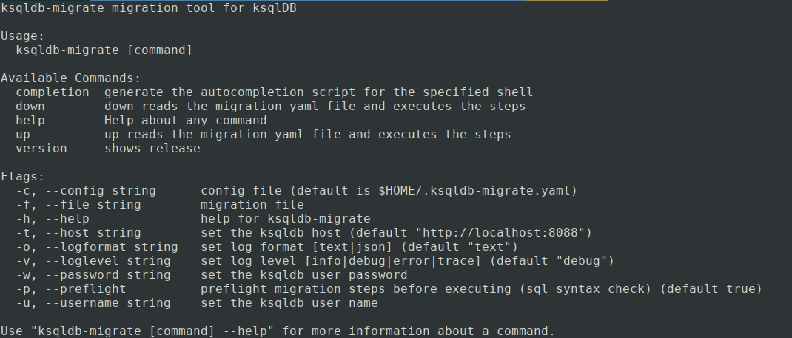

# ksqldb-migrate

Migration tool for [ksqlDB](https://ksqldb.io), which uses the [ksqldb-go](https://github.com/thmeitz/ksqldb-go) client.

⚠️ Disclaimer #1: This is a personal project and not supported or endorsed by Confluent.

## Installation

```bash
go install github.com/thmeitz/ksqldb-migrate
```

## Usage

```bash
ksqldb-migrate
```



### Migration File

In further steps I'm using the [provided example](examples/test.yaml).

```yaml
---
up:
  - name: create source connector dogs
    exec: |
      CREATE SOURCE CONNECTOR DOGS WITH ('connector.class'='io.mdrogalis.voluble.VolubleSourceConnector',
      'key.converter'='org.apache.kafka.connect.storage.StringConverter',
      'value.converter'='org.apache.kafka.connect.json.JsonConverter',
      'value.converter.schemas.enable'='false',
      'genkp.dogs.with'='#{Internet.uuid}',
      'genv.dogs.name.with'='#{Dog.name}',
      'genv.dogs.dogsize.with'='#{Dog.size}',
      'genv.dogs.age.with'='#{Dog.age}',
      'topic.dogs.throttle.ms'=1000 
      );
  - name: create the dogs stream
    exec: |
      CREATE STREAM IF NOT EXISTS DOGS (ID STRING KEY,NAME STRING,DOGSIZE STRING, AGE STRING) 
      WITH (KAFKA_TOPIC='dogs', 
      VALUE_FORMAT='JSON', PARTITIONS=1);
  - name: create the DOGS_BY_SIZE table
    exec: |
      CREATE TABLE IF NOT EXISTS DOGS_BY_SIZE AS 
      SELECT DOGSIZE AS DOG_SIZE, COUNT(*) AS DOGS_CT 
      FROM DOGS WINDOW TUMBLING (SIZE 15 MINUTE) 
      GROUP BY DOGSIZE;
down:
  - name: drop table DOGS_BY_SIZE
    exec: DROP TABLE IF EXISTS DOGS_BY_SIZE;
  - name: delete stream DOGS
    exec: DROP STREAM IF EXISTS DOGS;
  - name: drop connector DOGS
    exec: DROP CONNECTOR IF EXISTS DOGS;
```

## Migrate Up


```bash
ksqldb-migrate up -f examples/test.yaml
```

Output


## Migrate Down

```bash
ksql-migrate down -f examples/test.yaml
```

Output


## Preflight Check

You can make a preflight check if you run `up/down`.

If there is an error you get following output:


Since the KSQLParser can find more than one error, the errors are in a slice.

The first number gives the row number, the second number the column number followed by the parser message.

## Docker Compose

Same `docker-compose` file as for [ksqldb-go](https://github.com/thmeitz/ksqldb-go/blob/main/examples/cobra-test/docker-compose.yml).

## Build

Only 64 Bit systems are supported.

This command builds the following binaries

- linux-amd64
- darwin-amd64
- windows-amd64

```bash
make release github.com/thmeitz/ksqldb-migrate
```

## TODO

- [ ] Better error messages for KSQLParser (ksqldb-go)
- [ ] Check CommandStatus and wait for successfull execution for each step (up/down migrations) (ksql-migrate + ksqldb-go)
- [ ] Static linked binary

## License

[Apache License Version 2.0](LICENSE)
